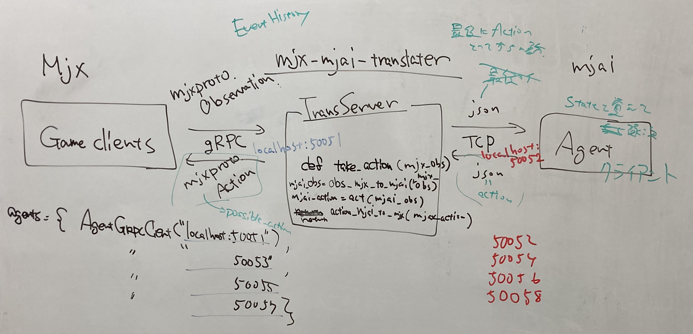

[](https://github.com/mjx-project/mjx_mjai_translater/actions/workflows/ci.yml)

# MjxMjaiTranslater



Welcome to your new gem! In this directory, you'll find the files you need to be able to package up your Ruby library into a gem. Put your Ruby code in the file `lib/mjx_mjai_translater`. To experiment with that code, run `bin/console` for an interactive prompt.

TODO: Delete this and the text above, and describe your gem

## Installation

Add this line to your application's Gemfile:

```ruby
gem 'mjx_mjai_translater'
```

And then execute:

    $ bundle

Or install it yourself as:

    $ gem install mjx_mjai_translater

## Usage

TODO: Write usage instructions here

## Development

After checking out the repo, run `bin/setup` to install dependencies. Then, run `rake spec` to run the tests. You can also run `bin/console` for an interactive prompt that will allow you to experiment.

To install this gem onto your local machine, run `bundle exec rake install`. To release a new version, update the version number in `version.rb`, and then run `bundle exec rake release`, which will create a git tag for the version, push git commits and tags, and push the `.gem` file to [rubygems.org](https://rubygems.org).

## How to start random agent

Generate necessary proto files and start gRPC server in ruby.

```
$ make protos
$ ruby mjx_mjai-translater/random_agent.rb
```

Build mjx and run game clients.

```
$ cd mjx && make build
$ ./mjx/build/scripts/speed_benchmark -client 256 16
```

## How to play
Please follow the order
1. start mjx agent
  ```
 $ cd lib
 $ cd mjx-mjai-translator
 $ ruby random_agent.rb
 ```
2. start trans_server
 ```
 $ cd lib
 $ cd mjx-mjai-translator
 $ ruby trans_sever.rb
 ```
3. start mjai client
 ```
 $ cd mjai
 $ mjai client --port=11600 mjai-shanten
 ```
4. start mjx simulator with code like below
```py
import mjx._mjx as _mjx

agent = _mjx.GrpcAgent('0.0.0.0:50051')
mjai_agent = _mjx.GrpcAgent('0.0.0.0:50052')
agents = {"player_0": agent, "player_1": agent, "player_2": agent, "player_3": mjai_agent}
_mjx.EnvRunner.run(agents)
```
## Contributing

Bug reports and pull requests are welcome on GitHub at https://github.com/mjx-project/mjx_mjai_translater.

## License

The gem is available as open source under the terms of the [MIT License](https://opensource.org/licenses/MIT).
